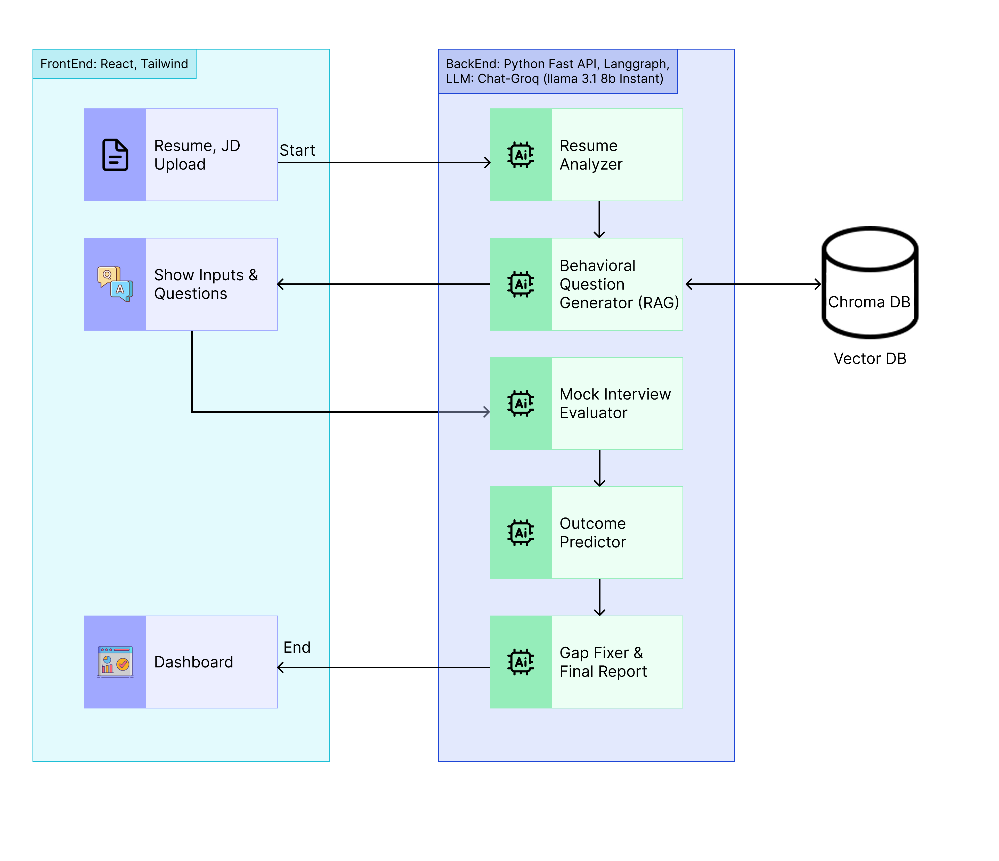

# 🧠 Interview Outcome Predictor & Booster

An AI-powered multi-agent system that helps job seekers practice mock interviews, analyze their resumes, predict interview outcomes, and get personalized improvement plans.

---

## 🗂️ Project Structure

```
interview-booster/
├── frontend/       # React + Tailwind UI
└── backend/        # FastAPI + LangGraph agents
```

---

## 🚀 Features

- ✅ Resume Analyzer (clarity, relevance, structure scoring)
- ✅ Behavioral Pattern Retriever (RAG-based Q&A from GitHub/YouTube/forums)
- ✅ Mock Interview Evaluator (text/audio with tone/confidence scoring)
- ✅ Outcome Predictor (0–100 success score)
- ✅ Gap Fixer Agent (actionable feedback + learning paths)
- ✅ Multi-agent LangGraph orchestration
- ✅ PDF/DOCX uploads, real-time API responses
- ✅ Dashboard with results & improvement tips

---

## 🖥️ Frontend – `frontend/`

### 📌 Tech Stack

- **React.js**
- **Tailwind CSS**
- **Axios**

### 🔧 Setup

```bash
cd frontend
npm install
npm start
```

### 📂 Main Pages

- `UploadPage`: Upload resume + job description
- `InterviewPractice`: Input text mock answers
- `Dashboard`: View resume score, interview scores, prediction
- `Improvements`: Tips & learning resources

---

## 🧠 Backend – `backend/`

### 📌 Tech Stack

- **FastAPI**
- **LangGraph / LangChain**
- **Groq (via `langchain_groq`)**
- **ChromaDB + Firecrawl API (for RAG)**
- **Pydantic Schemas**
- **StateGraph agents (resume_analysis, mock_evaluation, etc.)**

### 🧱 Core Agents

| Agent Name             | Task                                                    |
| ---------------------- | ------------------------------------------------------- |
| `resume_analysis`      | Rates clarity, relevance, and structure of the resume   |
| `behavioral_analysis`  | RAG-based Q&A retrieval based on job role               |
| `mock_evaluation`      | Evaluates mock responses using LLM + Whisper (if audio) |
| `outcome_prediction`   | Combines all scores to give 0–100 success likelihood    |
| `improvement_planning` | Suggests improvements and resources                     |

### 🔧 Setup

```bash
cd backend
python -m venv venv
source venv/bin/activate
pip install -r requirements.txt
uvicorn main:app --reload
```

---

## 🧪 Example Usage

### 1. Upload resume + job description

```bash
curl -X POST http://localhost:8000/run-interview-evaluation/   -F "resume=@resume.pdf"   -F "job_description=Software Engineer with focus on backend systems"
```

### 2. View result in dashboard

```bash
GET /dashboard/user_1
```

---

## 📸 Architecture

> 
